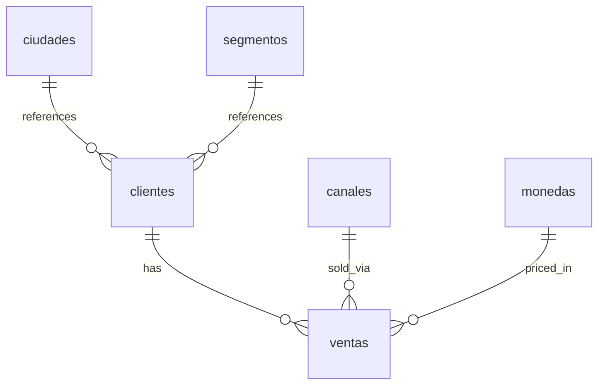

## Schema Overview

The PruebaETL database uses a **dual-schema approach**: RAW tables for original data preservation and normalized tables for optimized queries and analysis.

<CardGroup cols={2}>
  <Card title="RAW Tables" icon="file-archive">
    Store original, unprocessed data exactly as received
  </Card>
  
  <Card title="Normalized Tables" icon="table">
    Structured data with relationships and constraints
  </Card>
</CardGroup>

## Database Architecture

The database `PruebaTecnicaDNI` is created automatically by the ETL process:

```sql
-- crear_base_datos.py:11-22
IF NOT EXISTS (SELECT * FROM sys.databases WHERE name = 'PruebaTecnicaDNI')
BEGIN
    CREATE DATABASE PruebaTecnicaDNI;
END
GO

USE PruebaTecnicaDNI;
GO
```

## RAW Tables

RAW tables preserve the original data with minimal transformation:

### clientes_raw

**Purpose:** Audit trail of original customer data

```sql
-- crear_base_datos.py:28-41
CREATE TABLE clientes_raw (
    cliente_id INT,
    nombre NVARCHAR(255),
    ciudad NVARCHAR(100),
    segmento NVARCHAR(50),
    fecha_registro NVARCHAR(50),
    fecha_carga DATETIME DEFAULT GETDATE()
);
```

<Info>
  Notice that `fecha_registro` is stored as `NVARCHAR(50)` - preserving the original text format, not yet parsed as a date.
</Info>

**Key Features:**
- No primary key (data may contain duplicates)
- All fields nullable (accepts incomplete data)
- String types for all values (no validation)
- Automatic `fecha_carga` timestamp

### ventas_raw

**Purpose:** Audit trail of original sales transactions

```sql
-- crear_base_datos.py:43-57
CREATE TABLE ventas_raw (
    venta_id INT,
    cliente_id INT,
    fecha NVARCHAR(50),
    total NVARCHAR(50),
    moneda NVARCHAR(10),
    canal NVARCHAR(50),
    fecha_carga DATETIME DEFAULT GETDATE()
);
```

**Key Features:**
- `total` stored as text (may contain "1,403.70" or "N/A")
- `fecha` stored as text (may be in any format)
- No foreign keys or constraints

<Warning>
  RAW tables should never be used for queries or reports - they exist solely for audit purposes and data reprocessing.
</Warning>

## Normalized Tables

Normalized tables follow database best practices with proper constraints and relationships.

### Master Tables (Dimension Tables)

Master tables store unique reference values:

#### ciudades

```sql
-- crear_base_datos.py:63-73
CREATE TABLE ciudades (
    ciudad_id INT PRIMARY KEY IDENTITY(1,1),
    nombre NVARCHAR(100) NOT NULL UNIQUE,
    fecha_creacion DATETIME DEFAULT GETDATE()
);
```

**Features:**
- `IDENTITY(1,1)`: Auto-incrementing primary key
- `UNIQUE` constraint on `nombre`: No duplicate city names
- `NOT NULL`: Every city must have a name

#### segmentos

```sql
-- crear_base_datos.py:75-85
CREATE TABLE segmentos (
    segmento_id INT PRIMARY KEY IDENTITY(1,1),
    nombre NVARCHAR(50) NOT NULL UNIQUE,
    fecha_creacion DATETIME DEFAULT GETDATE()
);
```

#### canales

```sql
-- crear_base_datos.py:87-97
CREATE TABLE canales (
    canal_id INT PRIMARY KEY IDENTITY(1,1),
    nombre NVARCHAR(50) NOT NULL UNIQUE,
    fecha_creacion DATETIME DEFAULT GETDATE()
);
```

#### monedas

```sql
-- crear_base_datos.py:99-109
CREATE TABLE monedas (
    moneda_id INT PRIMARY KEY IDENTITY(1,1),
    codigo NVARCHAR(10) NOT NULL UNIQUE,
    fecha_creacion DATETIME DEFAULT GETDATE()
);
```

<Tip>
  All master tables follow the same pattern: auto-incrementing ID, unique name/code, and creation timestamp.
</Tip>

### Business Tables (Fact Tables)

Business tables contain the core data with foreign key relationships:

#### clientes

```sql
-- crear_base_datos.py:111-127
CREATE TABLE clientes (
    cliente_id INT PRIMARY KEY,
    nombre NVARCHAR(255) NOT NULL,
    ciudad_id INT NOT NULL,
    segmento_id INT NOT NULL,
    fecha_registro DATE,
    fecha_creacion DATETIME DEFAULT GETDATE(),
    fecha_actualizacion DATETIME DEFAULT GETDATE(),
    CONSTRAINT FK_clientes_ciudad 
        FOREIGN KEY (ciudad_id) REFERENCES ciudades(ciudad_id),
    CONSTRAINT FK_clientes_segmento 
        FOREIGN KEY (segmento_id) REFERENCES segmentos(segmento_id)
);
```

**Key Design Decisions:**

| Field | Type | Reason |
|-------|------|--------|
| `cliente_id` | `INT PRIMARY KEY` | Preserves original ID from CSV |
| `nombre` | `NVARCHAR(255) NOT NULL` | Supports Unicode characters (accents) |
| `ciudad_id` | `INT NOT NULL` | Foreign key - every customer must have a city |
| `segmento_id` | `INT NOT NULL` | Foreign key - every customer must have a segment |
| `fecha_registro` | `DATE` | Normalized date (no time component) |
| `fecha_creacion` | `DATETIME` | Audit timestamp (when record was created) |
| `fecha_actualizacion` | `DATETIME` | Audit timestamp (when record was last modified) |

**Foreign Key Constraints:**

```sql
CONSTRAINT FK_clientes_ciudad 
    FOREIGN KEY (ciudad_id) REFERENCES ciudades(ciudad_id)
```

This ensures:
- Cannot insert a customer with invalid `ciudad_id`
- Cannot delete a city that has customers
- Data integrity is enforced at the database level

#### ventas

```sql
-- crear_base_datos.py:129-146
CREATE TABLE ventas (
    venta_id INT PRIMARY KEY,
    cliente_id INT NOT NULL,
    fecha DATE,
    total DECIMAL(18,2) NOT NULL,
    moneda_id INT NOT NULL,
    canal_id INT NOT NULL,
    fecha_creacion DATETIME DEFAULT GETDATE(),
    CONSTRAINT FK_ventas_cliente 
        FOREIGN KEY (cliente_id) REFERENCES clientes(cliente_id),
    CONSTRAINT FK_ventas_moneda 
        FOREIGN KEY (moneda_id) REFERENCES monedas(moneda_id),
    CONSTRAINT FK_ventas_canal 
        FOREIGN KEY (canal_id) REFERENCES canales(canal_id)
);
```

**Key Design Decisions:**

| Field | Type | Reason |
|-------|------|--------|
| `venta_id` | `INT PRIMARY KEY` | Unique transaction identifier |
| `cliente_id` | `INT NOT NULL` | Foreign key - every sale must have a customer |
| `fecha` | `DATE` | Transaction date (no time) |
| `total` | `DECIMAL(18,2) NOT NULL` | Exact decimal precision (no rounding errors) |
| `moneda_id` | `INT NOT NULL` | Foreign key - every sale must have a currency |
| `canal_id` | `INT NOT NULL` | Foreign key - every sale must have a channel |

<Check>
  Using `DECIMAL(18,2)` instead of `FLOAT` ensures monetary values are stored with exact precision, avoiding floating-point rounding errors.
</Check>

## Entity Relationships

The database follows a **star schema** pattern with master tables (dimensions) connected to business tables (facts):

<Frame>
  
</Frame>

### Relationship Types

**One-to-Many Relationships:**

1. **ciudades → clientes**: One city can have many customers
2. **segmentos → clientes**: One segment can have many customers  
3. **clientes → ventas**: One customer can have many sales
4. **canales → ventas**: One channel can have many sales
5. **monedas → ventas**: One currency can have many sales



## Indexes for Performance

The schema includes indexes on frequently queried columns:

```sql
-- crear_base_datos.py:148-158
CREATE INDEX IX_clientes_ciudad_id ON clientes(ciudad_id);
CREATE INDEX IX_clientes_segmento_id ON clientes(segmento_id);
CREATE INDEX IX_ventas_cliente_id ON ventas(cliente_id);
CREATE INDEX IX_ventas_fecha ON ventas(fecha);
CREATE INDEX IX_ventas_moneda_id ON ventas(moneda_id);
CREATE INDEX IX_ventas_canal_id ON ventas(canal_id);
```

**Why These Indexes?**

| Index | Purpose | Query Example |
|-------|---------|---------------|
| `IX_clientes_ciudad_id` | Filter customers by city | `WHERE ciudad_id = 3` |
| `IX_clientes_segmento_id` | Filter customers by segment | `WHERE segmento_id = 1` |
| `IX_ventas_cliente_id` | Join sales to customers | `JOIN clientes ON ...` |
| `IX_ventas_fecha` | Filter sales by date range | `WHERE fecha BETWEEN '2024-01-01' AND '2024-12-31'` |
| `IX_ventas_moneda_id` | Group sales by currency | `GROUP BY moneda_id` |
| `IX_ventas_canal_id` | Analyze sales by channel | `GROUP BY canal_id` |

<Info>
  Indexes speed up read queries but slightly slow down write operations. This trade-off is acceptable for a data warehouse focused on analysis.
</Info>

## Data Types Rationale

### Why NVARCHAR Instead of VARCHAR?

```sql
nombre NVARCHAR(255) NOT NULL
```

**Reason:** `NVARCHAR` supports Unicode characters, essential for international names with accents:
- ✅ "José Ramón García"
- ✅ "María Fernández"
- ❌ VARCHAR would corrupt these characters

### Why DECIMAL(18,2) for Money?

```sql
total DECIMAL(18,2) NOT NULL
```

**Reason:** Exact decimal arithmetic for financial calculations:
- ✅ `DECIMAL`: 10.25 + 20.50 = 30.75 (exact)
- ❌ `FLOAT`: 10.25 + 20.50 = 30.750000000000004 (rounding error)

### Why DATE Instead of DATETIME?

```sql
fecha DATE
```

**Reason:** The data only contains dates, no times:
- Saves storage space (3 bytes vs 8 bytes)
- Cleaner for date-based queries
- Avoids time zone complications

## Data Insertion Process

The ETL script generates INSERT statements for all normalized data:

### Master Tables (with IDENTITY_INSERT)

```python
# crear_base_datos.py:186-194
sql_inserts.append("SET IDENTITY_INSERT ciudades ON;")
for ciudad in ciudades:
    nombre = ciudad['nombre'].replace("'", "''").replace('\n', ' ')
    sql_inserts.append(
        f"INSERT INTO ciudades (ciudad_id, nombre) "
        f"VALUES ({ciudad['ciudad_id']}, '{nombre}');"
    )
sql_inserts.append("SET IDENTITY_INSERT ciudades OFF;")
```

<Warning>
  `SET IDENTITY_INSERT ON` allows manual insertion of IDs, bypassing the auto-increment. This is necessary to preserve the relationships from the normalization process.
</Warning>

### Business Tables

```python
# crear_base_datos.py:230-239
for cliente in clientes:
    nombre = cliente['nombre'].replace("'", "''").replace('\n', ' ')
    fecha = cliente['fecha_registro'] if cliente['fecha_registro'] else 'NULL'
    if fecha != 'NULL':
        fecha = f"'{fecha}'"
    sql_inserts.append(
        f"INSERT INTO clientes (cliente_id, nombre, ciudad_id, "
        f"segmento_id, fecha_registro) "
        f"VALUES ({cliente['cliente_id']}, '{nombre}', {cliente['ciudad_id']}, "
        f"{cliente['segmento_id']}, {fecha});"
    )
```

## Querying the Schema

With the normalized schema, complex queries become simple:

### Total Sales by City

```sql
SELECT 
    c.nombre AS ciudad,
    COUNT(v.venta_id) AS total_ventas,
    SUM(v.total) AS monto_total
FROM ventas v
INNER JOIN clientes cl ON v.cliente_id = cl.cliente_id
INNER JOIN ciudades c ON cl.ciudad_id = c.ciudad_id
GROUP BY c.nombre
ORDER BY monto_total DESC;
```

### Sales by Channel and Currency

```sql
SELECT 
    ca.nombre AS canal,
    m.codigo AS moneda,
    COUNT(v.venta_id) AS num_ventas,
    AVG(v.total) AS promedio
FROM ventas v
INNER JOIN canales ca ON v.canal_id = ca.canal_id
INNER JOIN monedas m ON v.moneda_id = m.moneda_id
GROUP BY ca.nombre, m.codigo
ORDER BY canal, moneda;
```

### Customer Segment Analysis

```sql
SELECT 
    s.nombre AS segmento,
    COUNT(DISTINCT c.cliente_id) AS num_clientes,
    COUNT(v.venta_id) AS num_ventas,
    SUM(v.total) AS ventas_totales
FROM clientes c
INNER JOIN segmentos s ON c.segmento_id = s.segmento_id
LEFT JOIN ventas v ON c.cliente_id = v.cliente_id
GROUP BY s.nombre
ORDER BY ventas_totales DESC;
```

<Tip>
  The normalized schema makes these queries fast and efficient thanks to foreign key indexes.
</Tip>

## Schema Validation

After running the SQL script, verify the schema:

```sql
-- Check table count
SELECT COUNT(*) FROM sys.tables;
-- Should return 8 (2 RAW + 6 normalized)

-- Check foreign keys
SELECT 
    fk.name AS foreign_key_name,
    tp.name AS parent_table,
    tr.name AS referenced_table
FROM sys.foreign_keys fk
INNER JOIN sys.tables tp ON fk.parent_object_id = tp.object_id
INNER JOIN sys.tables tr ON fk.referenced_object_id = tr.object_id;

-- Check indexes
SELECT 
    i.name AS index_name,
    t.name AS table_name,
    COL_NAME(ic.object_id, ic.column_id) AS column_name
FROM sys.indexes i
INNER JOIN sys.index_columns ic ON i.object_id = ic.object_id AND i.index_id = ic.index_id
INNER JOIN sys.tables t ON i.object_id = t.object_id
WHERE i.is_primary_key = 0;
```

## Next Steps

<CardGroup cols={2}>
  <Card title="ETL Process" icon="arrows-spin" href="/concepts/etl-process">
    Learn how data flows through the pipeline
  </Card>
  
  <Card title="Normalization" icon="layer-group" href="/concepts/normalization">
    Understand entity extraction and normalization
  </Card>
</CardGroup>