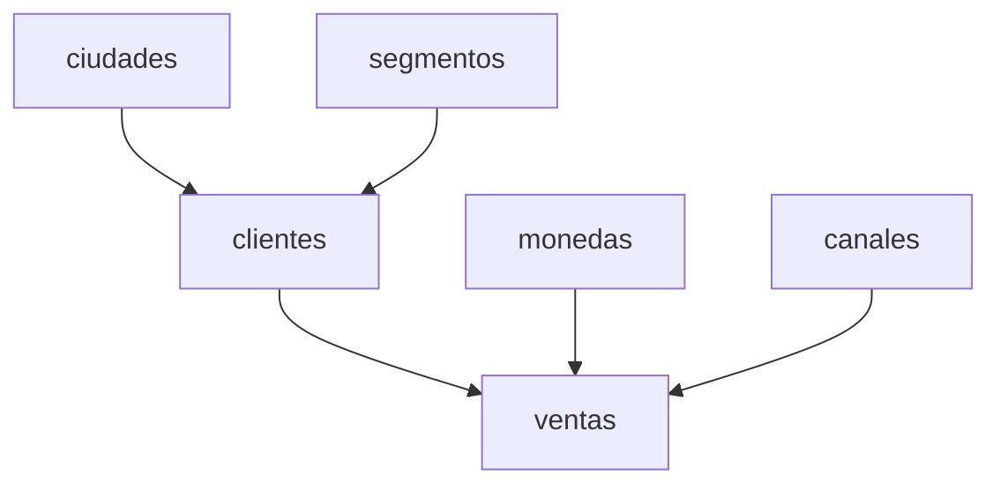

## Deployment Overview

The database deployment process consists of:

1. **Script Generation**: Python creates SQL DDL and DML scripts
2. **Script Execution**: SQL Server Management Studio executes the scripts
3. **Data Loading**: Raw and normalized data inserted from CSV files
4. **Verification**: Database structure and data validated

## Prerequisites

<AccordionGroup>
  <Accordion title="Required Software">
    - **SQL Server**: 2016 or later (Express, Standard, or Enterprise)
    - **SQL Server Management Studio** (SSMS): Version 18.0 or later
    - **Python**: 3.7 or later with standard library
  </Accordion>
  
  <Accordion title="Required Files">
    - `crear_base_datos.py` (script generator)
    - `clientes_prueba_mas_datos.csv` (raw customer data)
    - `ventas_prueba_mas_datos.csv` (raw sales data)
    - CSV files in `cleanData/` directory:
      - `ciudades.csv`
      - `segmentos.csv`
      - `canales.csv`
      - `monedas.csv`
      - `clientes_normalizados.csv`
      - `ventas_normalizadas.csv`
  </Accordion>
  
  <Accordion title="SQL Server Permissions">
    - `CREATE DATABASE` permission
    - `db_owner` role on target database
    - Ability to create tables, indexes, and constraints
  </Accordion>
</AccordionGroup>

## Step 1: Generate SQL Script

Run the Python script to generate the complete database creation script:

```bash
python crear_base_datos.py
```

**Expected Output:**

```
Generando script SQL para crear la base de datos...
✓ Script SQL generado: crear_base_datos.sql
  Tamaño: 45823 caracteres

Para ejecutar el script:
  1. Abre SQL Server Management Studio
  2. Conéctate a tu servidor SQL Server
  3. Abre el archivo 'crear_base_datos.sql'
  4. Ejecuta el script completo

¡Proceso completado!
```

**What Gets Generated:**

The script `crear_base_datos.sql` contains:
- Database creation statement
- All table definitions (raw and normalized)
- Primary key constraints
- Foreign key constraints
- Indexes for performance optimization
- INSERT statements for all data

## Step 2: Open SQL Server Management Studio

1. Launch **SQL Server Management Studio**
2. Connect to your SQL Server instance:
   - **Server type**: Database Engine
   - **Server name**: Your SQL Server instance (e.g., `localhost`, `.`, or `SERVERNAME\SQLEXPRESS`)
   - **Authentication**: Windows Authentication or SQL Server Authentication

<Tip>
For local development, `localhost` or `.` typically connects to the default instance.
</Tip>

## Step 3: Open the Generated Script

1. In SSMS, go to **File** → **Open** → **File...**
2. Navigate to and select `crear_base_datos.sql`
3. The script will open in a new query window

<Note>
Ensure the script encoding is UTF-8 to properly handle special characters in Spanish text.
</Note>

## Step 4: Execute the Script

**Important:** Execute the entire script in one go to maintain transaction consistency.

### Option A: Execute All (Recommended)

1. Ensure no text is selected in the query window
2. Press **F5** or click **Execute**
3. The entire script will run sequentially

### Option B: Execute with GO Batches

The script uses `GO` statements to separate batches. SSMS will execute each batch in order:

```sql
CREATE DATABASE PruebaTecnicaDNI;
GO  -- Batch separator

USE PruebaTecnicaDNI;
GO  -- Batch separator

CREATE TABLE ciudades (...);
GO  -- Batch separator
```

**Execution Progress:**

The Messages pane will show:
- Database creation confirmation
- Table creation statements
- Number of rows inserted
- Any errors or warnings

## Understanding the Script Structure

The generated SQL script follows this execution order:

### 1. Database Creation

```sql
IF NOT EXISTS (SELECT * FROM sys.databases WHERE name = 'PruebaTecnicaDNI')
BEGIN
    CREATE DATABASE PruebaTecnicaDNI;
END
GO

USE PruebaTecnicaDNI;
GO
```

**Safety Features:**
- Checks if database already exists
- Creates only if missing
- Switches to new database context

### 2. Raw Table Creation

```sql
-- Drop existing table if present
IF OBJECT_ID('clientes_raw', 'U') IS NOT NULL
    DROP TABLE clientes_raw;
GO

-- Create table
CREATE TABLE clientes_raw (
    cliente_id INT,
    nombre NVARCHAR(255),
    ciudad NVARCHAR(100),
    segmento NVARCHAR(50),
    fecha_registro NVARCHAR(50),
    fecha_carga DATETIME DEFAULT GETDATE()
);
GO
```

**Safety Features:**
- Drops existing table before recreation
- Allows script re-execution
- Preserves idempotency

### 3. Normalized Table Creation

Tables created in dependency order:

```sql
-- Dimension tables first (no dependencies)
CREATE TABLE ciudades (...);
GO

CREATE TABLE segmentos (...);
GO

CREATE TABLE canales (...);
GO

CREATE TABLE monedas (...);
GO

-- Fact tables second (with foreign keys)
CREATE TABLE clientes (...);
GO

CREATE TABLE ventas (...);
GO
```

### 4. Index Creation

```sql
CREATE INDEX IX_clientes_ciudad_id ON clientes(ciudad_id);
CREATE INDEX IX_clientes_segmento_id ON clientes(segmento_id);
CREATE INDEX IX_ventas_cliente_id ON ventas(cliente_id);
CREATE INDEX IX_ventas_fecha ON ventas(fecha);
CREATE INDEX IX_ventas_moneda_id ON ventas(moneda_id);
CREATE INDEX IX_ventas_canal_id ON ventas(canal_id);
GO
```

**Why Last:**
- Tables must exist before indexes
- Indexes created on empty tables are faster
- Optimizes query performance from the start

### 5. Raw Data Insertion

```sql
-- Insertar datos RAW: Clientes
INSERT INTO clientes_raw (cliente_id, nombre, ciudad, segmento, fecha_registro) 
VALUES (1, 'Juan Pérez', 'Madrid', 'Corporativo', '2023-01-15');
INSERT INTO clientes_raw (cliente_id, nombre, ciudad, segmento, fecha_registro) 
VALUES (2, 'María García', 'Barcelona', 'PYME', '2023-02-20');
-- ... more inserts
GO
```

### 6. Normalized Data Insertion

Inserted in dependency order using SET IDENTITY_INSERT:

```sql
-- Dimension tables first
SET IDENTITY_INSERT ciudades ON;
INSERT INTO ciudades (ciudad_id, nombre) VALUES (1, 'Madrid');
INSERT INTO ciudades (ciudad_id, nombre) VALUES (2, 'Barcelona');
SET IDENTITY_INSERT ciudades OFF;
GO

-- Fact tables second
INSERT INTO clientes (cliente_id, nombre, ciudad_id, segmento_id, fecha_registro) 
VALUES (1, 'Juan Pérez', 1, 1, '2023-01-15');
GO
```

## SET IDENTITY_INSERT Explained

SQL Server's IDENTITY columns auto-generate values, but the ETL process needs to insert specific IDs to maintain referential integrity.

### Purpose

`SET IDENTITY_INSERT` allows explicit insertion of values into IDENTITY columns.

### Syntax

```sql
SET IDENTITY_INSERT schema.table ON;
-- Insert statements with explicit ID values
SET IDENTITY_INSERT schema.table OFF;
```

### Usage in PruebaETL

```sql
-- Enable explicit ID insertion
SET IDENTITY_INSERT ciudades ON;

-- Insert with specific ciudad_id values
INSERT INTO ciudades (ciudad_id, nombre) VALUES (1, 'Madrid');
INSERT INTO ciudades (ciudad_id, nombre) VALUES (2, 'Barcelona');
INSERT INTO ciudades (ciudad_id, nombre) VALUES (3, 'Valencia');

-- Disable explicit ID insertion
SET IDENTITY_INSERT ciudades OFF;
GO
```

### Why It's Necessary

**Scenario Without SET IDENTITY_INSERT:**

```sql
-- This would fail on IDENTITY columns
INSERT INTO ciudades (ciudad_id, nombre) VALUES (1, 'Madrid');
-- Error: Cannot insert explicit value for identity column
```

**With SET IDENTITY_INSERT:**

```sql
SET IDENTITY_INSERT ciudades ON;
INSERT INTO ciudades (ciudad_id, nombre) VALUES (1, 'Madrid');
SET IDENTITY_INSERT ciudades OFF;
-- Success: Explicit ID preserved from source data
```

### Important Rules

<Warning>
- Only ONE table per connection can have IDENTITY_INSERT ON at a time
- Must explicitly specify the IDENTITY column in INSERT statement
- Always turn OFF after completing inserts
- Required when migrating data with existing IDs
</Warning>

### Application in ETL

The ETL process pre-assigns IDs during normalization, so these IDs must be preserved:

1. **ciudades.csv** contains:
   ```
   ciudad_id,nombre
   1,Madrid
   2,Barcelona
   ```

2. **clientes_normalizados.csv** references these IDs:
   ```
   cliente_id,nombre,ciudad_id,segmento_id
   1,Juan Pérez,1,1
   ```

3. **Without preserving IDs**, foreign key relationships would break

4. **With SET IDENTITY_INSERT**, referential integrity maintained

## Data Insertion Order

The script enforces strict insertion order to satisfy foreign key constraints:



**Execution Sequence:**

1. Dimension tables (no dependencies):
   - ciudades
   - segmentos
   - canales
   - monedas

2. Customer fact table:
   - clientes (depends on ciudades, segmentos)

3. Sales fact table:
   - ventas (depends on clientes, monedas, canales)

<Note>
Violating this order will cause foreign key constraint errors.
</Note>

## Verification Queries

After script execution, verify the deployment:

### Check Database Creation

```sql
SELECT name, database_id, create_date 
FROM sys.databases 
WHERE name = 'PruebaTecnicaDNI';
```

### Check Table Creation

```sql
USE PruebaTecnicaDNI;
GO

SELECT 
    TABLE_SCHEMA,
    TABLE_NAME,
    TABLE_TYPE
FROM INFORMATION_SCHEMA.TABLES
ORDER BY TABLE_NAME;
```

**Expected Output:**
- clientes
- clientes_raw
- ciudades
- canales
- monedas
- segmentos
- ventas
- ventas_raw

### Check Row Counts

```sql
SELECT 
    'clientes_raw' AS tabla, COUNT(*) AS filas FROM clientes_raw
UNION ALL
SELECT 'ventas_raw', COUNT(*) FROM ventas_raw
UNION ALL
SELECT 'ciudades', COUNT(*) FROM ciudades
UNION ALL
SELECT 'segmentos', COUNT(*) FROM segmentos
UNION ALL
SELECT 'canales', COUNT(*) FROM canales
UNION ALL
SELECT 'monedas', COUNT(*) FROM monedas
UNION ALL
SELECT 'clientes', COUNT(*) FROM clientes
UNION ALL
SELECT 'ventas', COUNT(*) FROM ventas;
```

### Check Foreign Key Constraints

```sql
SELECT 
    fk.name AS constraint_name,
    tp.name AS parent_table,
    cp.name AS parent_column,
    tr.name AS referenced_table,
    cr.name AS referenced_column
FROM sys.foreign_keys AS fk
INNER JOIN sys.foreign_key_columns AS fkc 
    ON fk.object_id = fkc.constraint_object_id
INNER JOIN sys.tables AS tp 
    ON fkc.parent_object_id = tp.object_id
INNER JOIN sys.columns AS cp 
    ON fkc.parent_object_id = cp.object_id 
    AND fkc.parent_column_id = cp.column_id
INNER JOIN sys.tables AS tr 
    ON fkc.referenced_object_id = tr.object_id
INNER JOIN sys.columns AS cr 
    ON fkc.referenced_object_id = cr.object_id 
    AND fkc.referenced_column_id = cr.column_id
ORDER BY tp.name, fk.name;
```

**Expected Constraints:**
- FK_clientes_ciudad
- FK_clientes_segmento
- FK_ventas_cliente
- FK_ventas_moneda
- FK_ventas_canal

### Check Indexes

```sql
SELECT 
    OBJECT_NAME(i.object_id) AS table_name,
    i.name AS index_name,
    i.type_desc,
    COL_NAME(ic.object_id, ic.column_id) AS column_name
FROM sys.indexes AS i
INNER JOIN sys.index_columns AS ic 
    ON i.object_id = ic.object_id 
    AND i.index_id = ic.index_id
WHERE i.name LIKE 'IX_%'
ORDER BY table_name, index_name;
```

## Troubleshooting

### Error: Database already exists

**Message:**
```
Database 'PruebaTecnicaDNI' already exists.
```

**Solution:**
The script handles this gracefully with `IF NOT EXISTS`. To force recreation:

```sql
DROP DATABASE PruebaTecnicaDNI;
GO
```

Then re-execute the script.

### Error: Cannot drop table (foreign key constraint)

**Message:**
```
Could not drop object 'clientes' because it is referenced by a FOREIGN KEY constraint.
```

**Solution:**
Drop tables in reverse dependency order:

```sql
DROP TABLE ventas;
DROP TABLE clientes;
DROP TABLE ciudades, segmentos, canales, monedas;
```

### Error: INSERT statement conflicted with FOREIGN KEY constraint

**Message:**
```
The INSERT statement conflicted with the FOREIGN KEY constraint "FK_clientes_ciudad".
```

**Solution:**
This indicates dimension tables weren't populated before fact tables. Ensure:
1. ciudades populated before clientes
2. clientes populated before ventas

Re-run the script from the beginning.

### Error: Cannot insert explicit value for identity column

**Message:**
```
Cannot insert explicit value for identity column in table 'ciudades' when IDENTITY_INSERT is set to OFF.
```

**Solution:**
Ensure `SET IDENTITY_INSERT table ON;` precedes INSERT statements:

```sql
SET IDENTITY_INSERT ciudades ON;
INSERT INTO ciudades (ciudad_id, nombre) VALUES (1, 'Madrid');
SET IDENTITY_INSERT ciudades OFF;
```

### Error: IDENTITY_INSERT is already ON for another table

**Message:**
```
IDENTITY_INSERT is already ON for table 'db.dbo.ciudades'. Cannot perform SET operation for table 'segmentos'.
```

**Solution:**
Always turn OFF IDENTITY_INSERT before enabling it on another table:

```sql
SET IDENTITY_INSERT ciudades OFF;
GO
SET IDENTITY_INSERT segmentos ON;
```

### Warning: Encoding issues with special characters

**Symptoms:**
Spanish characters (á, é, í, ó, ú, ñ, ü) appear as �� or garbled.

**Solution:**
1. Ensure `crear_base_datos.sql` is saved as UTF-8
2. Open in SSMS and verify encoding
3. Regenerate with proper encoding:

```python
with open('crear_base_datos.sql', 'w', encoding='utf-8') as f:
    f.write(script)
```

## Performance Considerations

### Large Datasets

For large CSV files (>100,000 rows):

<Accordion title="Use BULK INSERT Instead">
```sql
BULK INSERT clientes_raw
FROM 'C:\path\to\clientes_prueba_mas_datos.csv'
WITH (
    FIELDTERMINATOR = ',',
    ROWTERMINATOR = '\n',
    FIRSTROW = 2,
    CODEPAGE = '65001' -- UTF-8
);
```
</Accordion>

<Accordion title="Batch INSERT Statements">
Instead of single-row INSERTs, batch them:

```sql
INSERT INTO ciudades (ciudad_id, nombre) VALUES
    (1, 'Madrid'),
    (2, 'Barcelona'),
    (3, 'Valencia');
```
</Accordion>

<Accordion title="Disable Indexes During Load">
```sql
-- Drop indexes
DROP INDEX IX_ventas_cliente_id ON ventas;

-- Load data
INSERT INTO ventas (...) VALUES (...);

-- Recreate indexes
CREATE INDEX IX_ventas_cliente_id ON ventas(cliente_id);
```
</Accordion>

## Redeployment

To redeploy the database:

1. **Complete Rebuild:**
   ```sql
   DROP DATABASE PruebaTecnicaDNI;
   GO
   ```
   Then re-execute `crear_base_datos.sql`

2. **Table-Only Rebuild:**
   The script already includes `DROP TABLE IF EXISTS` statements

3. **Data Refresh Only:**
   ```sql
   TRUNCATE TABLE ventas;
   TRUNCATE TABLE clientes;
   DELETE FROM ciudades;
   DELETE FROM segmentos;
   DELETE FROM canales;
   DELETE FROM monedas;
   ```
   Then re-run INSERT portions

## Next Steps

<CardGroup cols={2}>
  <Card title="Schema Generation" icon="code" href="/database/schema-generation">
    Understand how SQL scripts are generated
  </Card>
  <Card title="Table Structure" icon="table" href="/database/table-structure">
    Explore the complete database schema
  </Card>
</CardGroup>